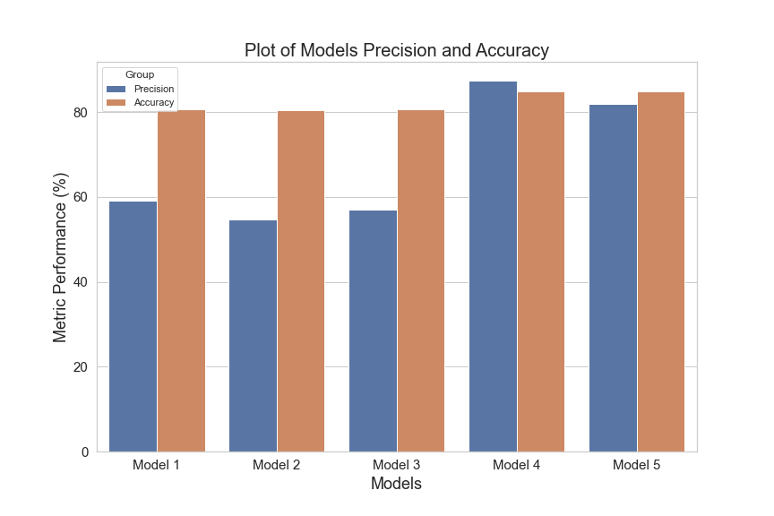
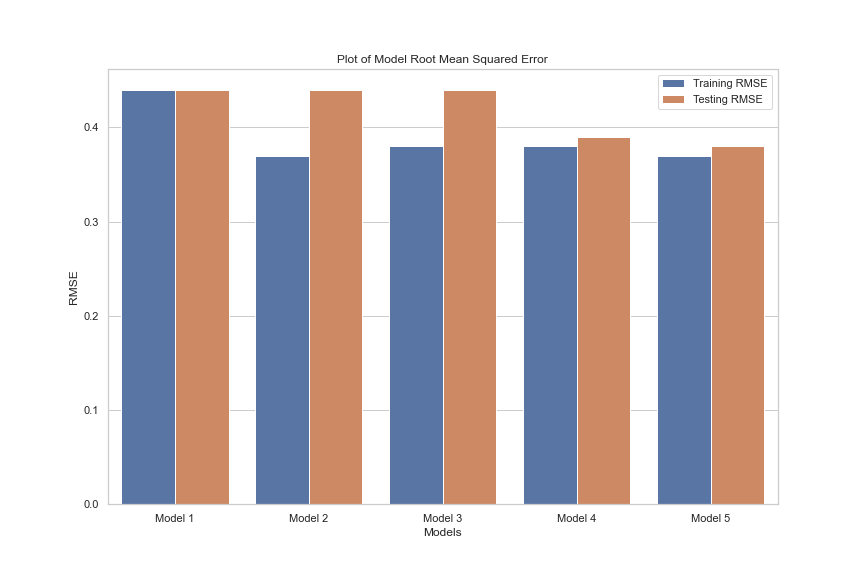

# Bank Customer Churn Classification

#### Author: Steve Githinji

## Overview

The project sought to assess whether we can accurately predict which customers are likely to churn based on their demographics and account information. This information is vital to the Bank Executives, Marketing and Retention Team and Customer Service Representives. This project took an iterative approach to modeling by building multiple models including a baseline logistic regression, K-nearest neighhbors, decision trees and random forests. GridSearchCV was used to perform hyperparameter tuning and model selection by exhaustively searching through a specified hyperparameter grid to find the best combination of hyperparameters. A parameter tuned Random Forest algorithm was eventually chosen as the final model since it performed the best in terms of accuracy, precision and root mean squared error. The model could  accurately predict which customers are likely to churn based on their demographics and account information with an accuracy of 85%, precision of 87.5% and RMSE of 0.39.

## Business Problem

Identifying customers who are likely to churn in advance can help banks implement targeted retention strategies, thereby reducing customer attrition and maximizing profitability. Machine learning techniques can play a crucial role in predicting customer churn, enabling banks to take proactive measures to retain valuable customers. The ultimate goal is to enable the bank to prioritize retention efforts and develop tailored strategies to retain customers at risk of churn. The key stakeholders in this project are the Bank Executives, Marketing and Retention Team and Customer Service Representives. The study seeks to answer the question: "Can we accurately predict which customers are likely to churn based on their demographics and account information?"

## Data

The dataset contains 12 columns and 10,000 entries of customer information. The dataset did not contain any missing values. Predictor features are CreditScore, Geography, Gender, Age, Tenure, Balance, NumOfProducts, HasCrCard, IsActiveMember and EstimatedSalary while the target column is Exited. according to the Geography column, 50% of the records are for French customers, while the rest are for German and Spanish customers.

## Methods

The project was done on a jupyter notebook using Python programming language. The packages used were:pandas, numpy, matplotlib, seaborn, statsmodel and scikit-learn. Classification metrics adopted were precision, accuracy and RMSE.

Data preprocessing involved OneHotEncoding of categoriacl columns and scaling numerical features. A baseline Logistic Regression model was built as the starting point for comparison and established initial metrics that other models tried to improve on. Afterwards 4 more models were built. These were a vanilla K-Nearest Neighbors model, a parameter tuned K-Nearest Neighbors model and 2 Random Forest models with tuned hyperparameters.

## Results

**`Model 4`** was selected as the `final model`. It is an ensemble algorithm that used a `Random Forest Classifier`. It had the highest combined accuracy and precision and the least amount of overfitting. Model 4 had an accuracy of about 85% meaning that out of all the predictions this model made, 85% were correct. It had a precision of 87.5% meaning that out of  all the times the model said a customer churned, the customer in question actually churned 87.5% of the time.

## Conclusions

In conclusion, the final model demonstrated the power and effectiveness of analyzing the Bank Customer Churn dataset and predicting customer churn. Through careful hyperparameter tuning and model selection , a robust classification model capable of accurately predicting customer churn was successfully developed. An analysis and evaluation of various machine models i.e. logistic regression, K-nearest neighhbors, decision trees and random forests, provided valuable insights into theirt performance. Ultimately, model 4, a random forest model, was chosen as the most suitable choice, delivering the best performance metrics, including high accuracy and precision. 

The deployment of this classification model has the potential to offer tangible benefits to the bank executives. By automating the process of categorizing new instances based on historical bank customer data, this model can assist the executives make decisions on proactive measures to take to mitigate customer churn such as targeted advertising and offers.

### Next Steps

The next step is to deploy the model to a production environment where it can be used to make predictions on new data. Here we will  continuously monitor the performance of the churn classification model. We will keep track of evaluation metrics and periodically reevaluate the model's performance using new data. If the model's performance starts to degrade, we will consider retraining or updating the model with more recent data.

## For More Information

See the full analysis in the [Jupyter Notebook](https://github.com/stevegithinji/Bank-Customer-Churn-Classification/blob/master/Bank-Customer-Churn-Classification.ipynb) or review this [presentation]().

For additional info, contact Steve Githinji at githinjisteve96@gmail.com

## Repository Structure

